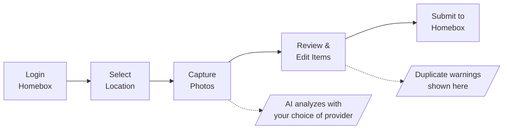

<h1 align="center" style="margin-top: -10px;"></h1>

<div align="center">
  <a href="#"></a>
</div>

<h1 align="center" style="margin-top: -10px;"> Homebox Companion (Enhanced Fork) </h1>

> **Fork of [Duelion/homebox-companion](https://github.com/Duelion/homebox-companion)** with privacy-first enhancements.
> Not affiliated with the Homebox project. This is an unofficial third-party companion app.

AI-powered companion for [Homebox](https://github.com/sysadminsmedia/homebox) inventory management.

<table align="center">
  <tr>
    <td></td>
    <td></td>
    <td></td>
    <td></td>
  </tr>
</table>

Take a photo of your stuff, and let AI identify and catalog items directly into your Homebox instance. Perfect for quickly inventorying a room, shelf, or collection.

## Fork Enhancements

This fork adds the following features while maintaining full compatibility with the upstream project:

| Feature | Description |
|---------|-------------|
| **Responsive Web UI** | Mobile-first design adapts to phone, tablet, and desktop |
| **Multi-Provider AI** | Switch between OpenAI, Anthropic, and Ollama from Settings |
| **Local AI (Ollama)** | Privacy-first local processing - images never leave your network |
| **Product Enrichment** | AI-powered spec lookup fills in product details from web search |
| **Duplicate Detection** | Multi-strategy matching (serial, manufacturer+model, fuzzy name) |
| **Update Existing Items** | Merge new photos/data into existing items when duplicates found |
| **Provider Fallback** | Auto-retry with backup provider if primary fails |
| **Configurable Timeouts** | Adjust AI timeout for slow models (30-600s) |
| **Token Usage Display** | Optional display of AI token consumption |
| **Custom API Endpoints** | OpenAI-compatible endpoints (Azure, LiteLLM proxy, etc.) |
| **PWA Support** | Install as app on mobile devices |
| **Pull-to-Refresh** | Native mobile gesture support |
| **Offline Indicator** | Shows when network connection is lost |
| **In-App Configuration** | Configure everything in the UI - no env vars required |

---

## Quick Start

### Docker Deployment

```yaml
# docker-compose.yml
services:
  homebox-companion:
    image: ghcr.io/synssins/homebox-companion:latest
    container_name: homebox-companion
    restart: always
    ports:
      - 8000:8000
    volumes:
      - ./homebox-companion:/data
```

```bash
docker compose up -d
```

Open `http://localhost:8000` and configure in the Settings page:
1. **Connection** - Enter your Homebox URL
2. **AI Provider** - Configure OpenAI, Anthropic, or Ollama
3. **Behavior** - Enable duplicate detection, token usage display

> **No environment variables required!** All configuration is done in the browser and persists in the `/data` volume.

### With Local AI (Ollama)

For complete privacy with no cloud dependencies:

```yaml
# docker-compose.yml
services:
  homebox-companion:
    image: ghcr.io/synssins/homebox-companion:latest
    container_name: homebox-companion
    restart: always
    ports:
      - 8000:8000
    volumes:
      - ./homebox-companion:/data

  ollama:
    image: ollama/ollama:latest
    container_name: ollama
    restart: always
    ports:
      - 11434:11434
    volumes:
      - ./ollama:/root/.ollama
    # For NVIDIA GPU support, uncomment:
    # deploy:
    #   resources:
    #     reservations:
    #       devices:
    #         - driver: nvidia
    #           count: 1
    #           capabilities: [gpu]
```

After starting, pull a vision model:
```bash
docker exec ollama ollama pull minicpm-v
```

Then in Settings > AI Provider:
1. Enable Ollama
2. Set URL to `http://ollama:11434`
3. Select model: `minicpm-v`
4. Click "Test Connection" to verify

---

## How It Works



1. **Login** - Authenticate with your existing Homebox credentials
2. **Select Location** - Browse location tree, search, or scan a Homebox QR code
3. **Capture Photos** - Take or upload photos (supports multiple photos per item)
4. **AI Detection** - AI vision identifies items, quantities, and metadata
5. **Review & Edit** - Adjust AI suggestions, see duplicate warnings, enrich product data
6. **Submit** - Items created in Homebox with photos attached

---

## Features

### Responsive Web UI

The interface adapts to any screen size:

- **Mobile** - Single-column layout, bottom navigation, pull-to-refresh
- **Tablet** - Two-column settings, optimized touch targets
- **Desktop** - Multi-column layout, expanded navigation

Install as a PWA on mobile for app-like experience with offline indicator.

### Multi-Provider AI

Configure and switch between AI providers in Settings:

| Provider | Privacy | Cost | Speed |
|----------|---------|------|-------|
| **Ollama** | 🟢 Local | Free | Variable (GPU dependent) |
| **OpenAI** | 🔴 Cloud | ~$0.01/img | Fast |
| **Anthropic** | 🔴 Cloud | ~$0.01/img | Fast |

**Features:**
- Enable/disable providers independently
- Active provider shown with ⭐ badge
- Custom API endpoints (Azure, LiteLLM proxy, OpenRouter)
- Provider fallback - auto-retry with backup if primary fails
- Configurable timeout (30-600s) for slow models

### Product Enrichment

AI-powered specification lookup:

- Searches web for product specs using manufacturer + model
- Fills in description, features, MSRP, release year, category
- Supports Tavily, Google Custom Search, or SearXNG
- Caches results to avoid repeated lookups
- Privacy-first: Serial numbers never sent externally

Enable in Settings > Enrichment.

### Duplicate Detection

Multi-strategy detection prevents duplicate entries:

| Strategy | Description |
|----------|-------------|
| **Serial Number** | Exact match on serial numbers |
| **Manufacturer + Model** | Matches same manufacturer AND model |
| **Fuzzy Name** | Similar product names (configurable threshold) |

When duplicates found:
- Warning banner shows matched item with confidence score
- **Update Existing** - Merge new photos, fill empty fields
- **Create New** - Override and create anyway
- Protected fields - Won't overwrite the match field

### In-App Configuration

All settings configurable in the browser:

| Section | Settings |
|---------|----------|
| **Connection** | Homebox URL, Image Quality |
| **AI Provider** | Provider selection, API keys, models, timeouts |
| **Behavior** | Duplicate detection, Token usage display |
| **Enrichment** | Enable/disable, Search provider, Cache duration |

Settings persist in `/data` volume.

---

## Original Features (Preserved)

All upstream features work unchanged:

### AI-Powered Detection
- Identifies multiple items in a single photo
- Extracts manufacturer, model, serial number, price
- Suggests labels from your existing Homebox labels
- Multi-language support

### Smart Workflow
- **Multi-image analysis** - Multiple angles for better accuracy
- **Single-item mode** - Force AI to treat photo as one item
- **AI corrections** - Tell AI what it got wrong, re-analyzes
- **Custom thumbnails** - Crop and select best image per item

### Location Management
- Browse hierarchical location tree
- Search locations by name
- Scan Homebox QR codes
- Create new locations on the fly

### Chat Assistant
- Natural language queries about your inventory
- Create, update, move, or delete items through conversation
- Approval workflow for destructive actions

---

## Configuration

### Environment Variables (Optional)

While all settings can be configured in the UI, environment variables work for automated deployments:

<details>
<summary>Click to expand full reference</summary>

**Core Settings**
| Variable | Default | Description |
|----------|---------|-------------|
| `HBC_HOMEBOX_URL` | - | Your Homebox instance URL |
| `HBC_IMAGE_QUALITY` | `medium` | Image quality: `raw`, `high`, `medium`, `low` |
| `HBC_DATA_DIR` | `/data` | Data directory path |
| `HBC_SERVER_PORT` | `8000` | Server port |
| `HBC_LOG_LEVEL` | `INFO` | Logging level |

**AI Provider Settings**
| Variable | Default | Description |
|----------|---------|-------------|
| `HBC_LLM_API_KEY` | - | OpenAI/Anthropic API key |
| `HBC_LLM_MODEL` | `gpt-4o-mini` | Cloud AI model |
| `HBC_LLM_API_BASE` | - | Custom API base URL |
| `HBC_LLM_TIMEOUT` | `120` | Request timeout (seconds) |
| `HBC_OLLAMA_URL` | `http://localhost:11434` | Ollama server URL |
| `HBC_OLLAMA_MODEL` | `minicpm-v` | Ollama vision model |
| `HBC_OLLAMA_TIMEOUT` | `120` | Ollama timeout (seconds) |

**Feature Flags**
| Variable | Default | Description |
|----------|---------|-------------|
| `HBC_DUPLICATE_DETECTION` | `true` | Enable duplicate detection |
| `HBC_SHOW_TOKEN_USAGE` | `false` | Show AI token usage |
| `HBC_CHAT_ENABLED` | `false` | Enable chat assistant |

**Enrichment Settings**
| Variable | Default | Description |
|----------|---------|-------------|
| `HBC_ENRICHMENT_ENABLED` | `false` | Enable product enrichment |
| `HBC_SEARCH_PROVIDER` | `none` | `tavily`, `google`, `searxng`, or `none` |
| `HBC_SEARCH_TAVILY_API_KEY` | - | Tavily API key |
| `HBC_SEARCH_GOOGLE_API_KEY` | - | Google API key |
| `HBC_SEARCH_GOOGLE_ENGINE_ID` | - | Google Search Engine ID |
| `HBC_SEARCH_SEARXNG_URL` | - | SearXNG instance URL |

</details>

### Data Volume

Mount `/data` to persist all configuration:

```
/data/
├── app_preferences.json    # UI settings
├── ai_config.json          # AI provider config
├── enrichment_cache.json   # Cached product specs
└── duplicate_index.json    # Serial number index
```

---

## Tips

- **Use local AI for privacy** - Ollama keeps all processing on your network
- **Enable duplicate detection** - Prevents re-adding existing items
- **Use "Update Existing"** - Merge new photos into existing items
- **Enable enrichment** - Auto-fill product specs from web search
- **Increase Ollama timeout** - Vision models on CPU need 300-600s
- **Set up fallback** - Ollama primary, cloud backup for reliability
- **Test connection** - Verifies model responds within timeout
- **Multiple angles** - Include close-ups of labels, serial numbers
- **Long press confirm** - Accept all items at once on review screen

---

## Compatibility

- **Upstream compatible** - All original features work unchanged
- **Homebox v0.21+** - Tested with recent Homebox versions
- **Environment variables** - All original env vars still work
- **API compatible** - No breaking changes to endpoints

---

## License

GNU General Public License v3.0 - see [LICENSE](LICENSE).

## Acknowledgments

- **[Duelion/homebox-companion](https://github.com/Duelion/homebox-companion)** - Original project
- [Homebox](https://github.com/sysadminsmedia/homebox) - The inventory system
- [OpenAI](https://openai.com) - Vision AI (GPT models)
- [Ollama](https://ollama.ai) - Local AI runtime
- [LiteLLM](https://docs.litellm.ai/) - LLM provider abstraction
- [FastAPI](https://fastapi.tiangolo.com) & [SvelteKit](https://kit.svelte.dev) - Backend & frontend
- [DaisyUI](https://daisyui.com) - UI component library

---

<p align="center">
  <i>Original project by <a href="https://github.com/Duelion">Duelion</a> -
  <a href="https://buymeacoffee.com/duelion" target="_blank">Buy them a coffee</a></i>
</p>
