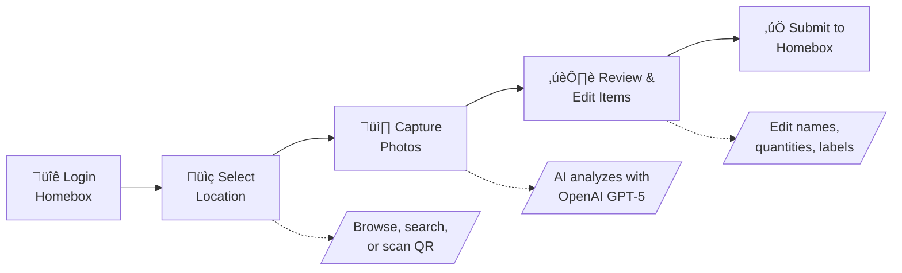

<h1 align="center" style="margin-top: -10px;"></h1>

<div align="center">
  <a href="#"></a>
</div>

<h1 align="center" style="margin-top: -10px;"> Homebox Companion </h1>

> **Not affiliated with the Homebox project.** This is an unofficial third-party companion app.

AI-powered companion for [Homebox](https://github.com/sysadminsmedia/homebox) inventory management.
<table align="center">
  <tr>
    <td></td>
    <td></td>
    <td></td>
    <td></td>
  </tr>
</table>

Take a photo of your stuff, and let AI identify and catalog items directly into your Homebox instance. Perfect for quickly inventorying a room, shelf, or collection.

<div align="center">
  <a href="https://demo.hbcompanion.duelion.com/" target="_blank">
    
  </a>
  <br>
  <sub><i>View results in the <a href="https://demo.hb.duelion.com/">Homebox demo instance</a></i></sub>
</div>

## 🔄 How It Works



1. **Login** – Authenticate with your existing Homebox credentials
2. **Select Location** – Browse the location tree, search, or scan a Homebox QR code
3. **Capture Photos** – Take or upload photos of items (supports multiple photos per item)
4. **AI Detection** – AI vision (via LiteLLM*) identifies items, quantities, and metadata
5. **Review & Edit** – Adjust AI suggestions, merge items, or ask AI to correct mistakes
6. **Submit** – Items are created in your Homebox inventory with photos attached

> *LiteLLM is a Python adaptor library we use to call OpenAI directly, no Local AI model required (unless you want to), just your API key.

## 💰 OpenAI Cost Estimates

**GPT-5 mini** (default) offers the best accuracy. **GPT-5 nano** is 3x cheaper but may need more corrections. Typical cost: **~$0.30 per 100 items** (mini) or **~$0.10 per 100 items** (nano).

*Prices as of **2025-12-10**, using OpenAI’s published pricing for GPT-5 mini and GPT-5 nano.*

## 📋 Requirements

Before you start, you'll need:

- **An OpenAI API key** – Get one at [platform.openai.com](https://platform.openai.com/api-keys)
- **A Homebox instance** – Your own [Homebox](https://github.com/sysadminsmedia/homebox) server, or use the [demo server](#try-with-demo-server) to test

> **Compatibility:** Tested with Homebox v0.21+. Earlier versions may have different authentication behavior.

## 🚀 Quick Start

### Try with Demo Server

Want to try it out without setting up Homebox? Use the public demo server:

```bash
docker run -p 8000:8000 \
  -e HBC_LLM_API_KEY=sk-your-key \
  -e HBC_HOMEBOX_URL=https://demo.homebox.software \
  ghcr.io/duelion/homebox-companion:latest
```

Open `http://localhost:8000` and login with `demo@example.com` / `demo`

### Docker (Recommended)

```yaml
# docker-compose.yml
services:
  homebox-companion:
    image: ghcr.io/duelion/homebox-companion:latest
    container_name: homebox-companion
    restart: always
    environment:
      - HBC_LLM_API_KEY=sk-your-api-key-here
      - HBC_HOMEBOX_URL=http://your-homebox-ip:7745
    ports:
      - 8000:8000
```

```bash
docker compose up -d
```

Open `http://localhost:8000` in your browser.

> **Tip:** If Homebox runs on the same machine but outside Docker, use `http://host.docker.internal:PORT` as the URL.

## ✨ Features

### AI-Powered Detection
- Identifies multiple items in a single photo
- Extracts manufacturer, model, serial number, price when visible
- Suggests labels from your existing Homebox labels
- Multi-language support

### Smart Workflow
- **Multi-image analysis** – Take photos from multiple angles for better accuracy
- **Single-item mode** – Force AI to treat a photo as one item (for sets/kits)
- **AI corrections** – Tell the AI what it got wrong and it re-analyzes
- **Custom thumbnails** – Crop and select the best image for each item

### Location Management
- Browse hierarchical location tree
- Search locations by name
- Scan Homebox QR codes
- Create new locations on the fly

### Customization
- Configure how AI formats each field (name style, description format, etc.)
- Set a default label for all detected items
- Export settings as environment variables for Docker persistence

## 🤖 LLM Provider Support

Homebox Companion uses [LiteLLM](https://docs.litellm.ai/) as a Python library to call AI providers. **You don't need to self-host anything** – just get an OpenAI API key from [platform.openai.com](https://platform.openai.com/api-keys) and you're ready to go. We officially support and test with OpenAI GPT models only.

<details>
<summary>Officially Supported Models</summary>

- **GPT-5 mini** (default) – Recommended for best balance of speed and accuracy
- **GPT-5 nano**

</details>

<details>
<summary>Using Other Providers (Experimental)</summary>

You can try other LiteLLM-compatible providers at your own risk. The app checks if your chosen model supports the required capabilities using LiteLLM's API:

**Required capabilities:**
- **Vision** – Checked via `litellm.supports_vision(model)`
- **Structured outputs** – Checked via `litellm.supports_response_schema(model)`

**Finding model names:**

Model names are passed directly to LiteLLM. Use the exact names from LiteLLM's documentation:
- [LiteLLM Supported Models](https://docs.litellm.ai/docs/providers)

Common examples:
- OpenAI: `gpt-4o`, `gpt-4o-mini`, `gpt-5-mini`
- Anthropic: `claude-sonnet-4-5`, `claude-3-5-sonnet-20241022`

> **Note:** Model names must exactly match LiteLLM's expected format. Typos or incorrect formats will cause errors. Check [LiteLLM's provider documentation](https://docs.litellm.ai/docs/providers) for the correct model names.

**Running Local Models:**

You can run models locally using tools like [Ollama](https://ollama.ai/), [LM Studio](https://lmstudio.ai/), or [vLLM](https://docs.vllm.ai/). See [LiteLLM's Local Server documentation](https://docs.litellm.ai/docs/providers/ollama) for setup instructions.

Once your local server is running, configure the app:

```bash
HBC_LLM_API_KEY=any-value-works-for-local  # Just needs to be non-empty
HBC_LLM_API_BASE=http://localhost:11434     # Your local server URL
HBC_LLM_MODEL=ollama/llava:34b              # Your local model name
HBC_LLM_ALLOW_UNSAFE_MODELS=true            # Required for most local models
```

**Note:** Local models must support vision (e.g., llava, bakllava, moondream). Performance and accuracy vary widely.

**⚠️ Important:** Other providers (Anthropic, Google, OpenRouter, local models, etc.) are **not officially supported**. If you encounter errors, we may not be able to help. Use at your own risk.

</details>

## ⚙️ Configuration

> **📝 Full reference:** See [`.env.example`](.env.example) for all available environment variables with detailed explanations and examples.

### Essential Settings

For a quick setup, you only need to provide your OpenAI API key. All other settings have sensible defaults.

| Variable | Required | Description |
|----------|----------|-------------|
| `HBC_LLM_API_KEY` | **Yes** | Your OpenAI API key |
| `HBC_HOMEBOX_URL` | No | Your Homebox instance URL (defaults to demo server) |

<details>
<summary>⚙️ Full Configuration Reference</summary>

| Variable | Default | Description |
|----------|---------|-------------|
| `HBC_LLM_MODEL` | `gpt-5-mini` | Model to use. Supported: `gpt-5-mini`, `gpt-5-nano`. |
| `HBC_LLM_API_BASE` | – | Custom API base URL (for proxies or experimental providers) |
| `HBC_LLM_ALLOW_UNSAFE_MODELS` | `false` | Skip capability validation for unrecognized models |
| `HBC_LLM_TIMEOUT` | `120` | LLM request timeout in seconds |
| `HBC_IMAGE_QUALITY` | `medium` | Image quality for Homebox uploads: `raw`, `high`, `medium`, `low` |

</details>

### Advanced Settings

<details>
<summary>Image Quality</summary>

Control compression applied to images uploaded to Homebox. Compression happens server-side during AI analysis to avoid slowing down mobile devices.

| Quality Level | Max Dimension | JPEG Quality | File Size | Use Case |
|--------------|---------------|--------------|-----------|----------|
| `raw` | No limit | Original | Largest | Full quality originals |
| `high` | 2560px | 85% | Large | Best quality, moderate size |
| `medium` | 1920px | 75% | Moderate | **Default** - balanced |
| `low` | 1280px | 60% | Smallest | Faster uploads, smaller storage |

**Example:**
```bash
HBC_IMAGE_QUALITY=high
```

**Note:** This setting only affects images uploaded to Homebox. AI analysis always uses optimized images regardless of this setting.

</details>

<details>
<summary>Capture Limits</summary>

| Variable | Default | Description |
|----------|---------|-------------|
| `HBC_CAPTURE_MAX_IMAGES` | `30` | Maximum photos per capture session |
| `HBC_CAPTURE_MAX_FILE_SIZE_MB` | `10` | Maximum file size per image in MB |

**Note:** These are experimental settings. It's advisable to keep the default values to minimize data loss risk during capture sessions.

</details>

<details>
<summary>Rate Limiting</summary>

| Variable | Default | Description |
|----------|---------|-------------|
| `HBC_RATE_LIMIT_ENABLED` | `true` | Enable/disable API rate limiting |
| `HBC_RATE_LIMIT_RPM` | `400` | Requests per minute (80% of Tier 1 limit) |
| `HBC_RATE_LIMIT_TPM` | `400000` | Tokens per minute (80% of Tier 1 limit) |
| `HBC_RATE_LIMIT_BURST_MULTIPLIER` | `1.5` | Burst capacity multiplier |

**Note:** Default settings are conservative (80% of OpenAI Tier 1 limits). Only configure if you have a higher-tier account or need to adjust limits.

**Examples for different OpenAI tiers:**
- Tier 2: `HBC_RATE_LIMIT_RPM=4000` `HBC_RATE_LIMIT_TPM=1600000`
- Tier 3: `HBC_RATE_LIMIT_RPM=4000` `HBC_RATE_LIMIT_TPM=3200000`

</details>

<details>
<summary>Server & Logging</summary>

| Variable | Default | Description |
|----------|---------|-------------|
| `HBC_SERVER_HOST` | `0.0.0.0` | Server bind address |
| `HBC_SERVER_PORT` | `8000` | Server port |
| `HBC_LOG_LEVEL` | `INFO` | Logging level |
| `HBC_DISABLE_UPDATE_CHECK` | `false` | Disable update notifications |
| `HBC_MAX_UPLOAD_SIZE_MB` | `20` | Maximum file upload size in MB |
| `HBC_CORS_ORIGINS` | `*` | Allowed CORS origins (comma-separated or `*`) |

</details>

<details>
<summary>AI Output Customization</summary>

Customize how AI formats detected item fields. Set via environment variables or the Settings page (UI takes priority).

| Variable | Description |
|----------|-------------|
| `HBC_AI_OUTPUT_LANGUAGE` | Language for AI output (default: English) |
| `HBC_AI_DEFAULT_LABEL_ID` | Label ID to auto-apply to all items |
| `HBC_AI_NAME` | Custom instructions for item naming |
| `HBC_AI_DESCRIPTION` | Custom instructions for descriptions |
| `HBC_AI_QUANTITY` | Custom instructions for quantity counting |
| `HBC_AI_MANUFACTURER` | Instructions for manufacturer extraction |
| `HBC_AI_MODEL_NUMBER` | Instructions for model number extraction |
| `HBC_AI_SERIAL_NUMBER` | Instructions for serial number extraction |
| `HBC_AI_PURCHASE_PRICE` | Instructions for price extraction |
| `HBC_AI_PURCHASE_FROM` | Instructions for retailer extraction |
| `HBC_AI_NOTES` | Custom instructions for notes |
| `HBC_AI_NAMING_EXAMPLES` | Example names to guide the AI |

**Tip:** The Settings page has an "Export as Environment Variables" button.

</details>

## 💡 Tips

- **Batch more items for faster uploads** – Images are analyzed by AI in parallel (up to 30 simultaneously), so adding more items actually feels faster than one at a time.
- **Include receipts in your photos** – AI can extract purchase price, retailer, and date from receipt images.
- **Multiple angles = better results** – Include close-ups of labels, serial numbers, or barcodes for more accurate detection.
- **HTTPS required for QR scanning** – Native camera QR detection only works over HTTPS. On HTTP, a "Take Photo" fallback is available.
- **Use the Settings page** – Customize AI behavior without restarting, then export settings as environment variables for Docker.
- **Long press to confirm all** – On the review screen, long-press the confirm button to accept all remaining items at once.

## 📄 License

This project is licensed under the GNU General Public License v3.0 - see the [LICENSE](LICENSE) file for details.

## 🙏 Acknowledgments

- [Homebox](https://github.com/sysadminsmedia/homebox) – The inventory system this app extends
- [OpenAI](https://openai.com) – Vision AI capabilities (GPT models)
- [LiteLLM](https://docs.litellm.ai/) – LLM provider abstraction layer
- [FastAPI](https://fastapi.tiangolo.com) & [SvelteKit](https://kit.svelte.dev) – Backend & frontend frameworks
<p align="center"> <a href="https://buymeacoffee.com/duelion" target="_blank" rel="noopener noreferrer">  </a> </p>
