# Homebox Companion

AI-powered companion app (unofficial) for [Homebox](https://github.com/sysadminsmedia/homebox) inventory management.

Take a photo of your stuff, and let AI identify and catalog items directly into your Homebox instance. Perfect for quickly inventorying a room, shelf, or collection.

## What It Does

Homebox Companion streamlines the process of adding items to your home inventory:

```mermaid
flowchart LR
    A[🔐 Login<br/>Homebox] --> B[📍 Select<br/>Location]
    B --> C[📸 Capture<br/>Photos]
    C --> D[✏️ Review &<br/>Edit Items]
    D --> E[✅ Submit to<br/>Homebox]
    
    B -.-> B1[/Browse, search,<br/>or scan QR/]
    C -.-> C1[/AI analyzes with<br/>OpenAI GPT-5/]
    D -.-> D1[/Edit names,<br/>quantities, labels/]
```



1. **Login** – Authenticate with your existing Homebox credentials
2. **Select Location** – Browse the location tree, search, or scan a Homebox QR code
3. **Capture Photos** – Take or upload photos of items (supports multiple photos per item)
4. **AI Detection** – OpenAI vision identifies items, quantities, and metadata
5. **Review & Edit** – Adjust AI suggestions, merge items, or ask AI to correct mistakes
6. **Submit** – Items are created in your Homebox inventory with photos attached

## Features

### Core Features
- **Photo-based Detection** – Upload or capture photos of items from your device
- **AI Vision Analysis** – Uses OpenAI GPT-5 to identify items in images
- **Smart Labeling** – Automatically suggests labels from your existing Homebox labels
- **Hierarchical Locations** – Navigate and select from your full location tree
- **QR Code Scanner** – Scan Homebox location QR codes to instantly select a location
  - *Note: HTTPS enables native hardware QR detection for real-time scanning (faster and more reliable). On HTTP, a "Take Photo" fallback is available.*
- **Batch Processing** – Analyze multiple photos in parallel for faster processing
- **Mobile-First UI** – Designed for phones (works great on desktop too)

### AI Capabilities
- **Multi-Image Analysis** – Upload multiple photos of the same item from different angles to improve detection accuracy. Include close-ups of labels, serial numbers, or receipts.
- **Extended Fields Detection** – Automatically extracts manufacturer, model number, serial number, purchase price when visible
- **Single-Item Mode** – Force AI to treat everything in a photo as one item (useful for sets/kits)
- **AI Corrections** – Tell the AI what it got wrong and it will re-analyze with your feedback
- **Label Matching** – AI suggests appropriate labels from your existing Homebox label library
- **Customizable Field Instructions** – Configure how the AI formats each field (name, description, notes, etc.)
- **Multi-Language Output** – Configure AI to respond in your preferred language

### Review Features
- **Edit Detected Items** – Modify names, quantities, descriptions before saving
- **Custom Thumbnails** – Crop and select the best thumbnail for each item
- **Skip or Confirm** – Review each detected item individually
- **Add More Photos** – Attach additional images during review for better AI analysis

### Location Management
- **Browse Locations** – Navigate your hierarchical location tree
- **Search Locations** – Quickly find any location by name
- **QR Code Scanning** – Scan a Homebox location QR code to select it instantly
- **Create Locations** – Add new locations directly from the app
- **Edit Locations** – Update location names and descriptions

### Settings & Customization
- **Default AI Tag** – Set a default label that's automatically applied to all detected items
- **Output Language** – Configure AI to respond in your preferred language
- **Field Customization** – Customize how AI formats each field:
  - Name format (e.g., "Title Case, include brand")
  - Description style (e.g., "Focus on condition and materials")
  - Notes guidelines (e.g., "Only mention defects")
  - Custom naming examples
  - And more (manufacturer, model, serial, price, etc.)
- **Export Environment Variables** – Export your customizations as environment variables for Docker persistence
- **AI Prompt Preview** – See exactly what the AI will receive based on your settings
- **Session Persistence** – Tab switching preserves your position in the scan flow

## Quick Start

### Docker (Recommended)

Pull the latest image from GitHub Container Registry:

```bash
docker pull ghcr.io/duelion/homebox-companion:latest
```

Create a `docker-compose.yml`:

```yaml
version: "3.4"

services:
  homebox-companion:
    image: ghcr.io/duelion/homebox-companion:latest
    container_name: homebox-companion
    restart: always
    environment:
      - HBC_OPENAI_API_KEY=sk-your-api-key-here
      - HBC_HOMEBOX_URL=http://192.168.1.100:7745
      - HBC_OPENAI_MODEL=gpt-5-mini
      # Optional: AI customizations (persist across container updates)
      # - HBC_AI_OUTPUT_LANGUAGE=Spanish
      # - HBC_AI_NAME=Always include brand first, then model
    ports:
      - 8000:8000
```

Run:

```bash
docker compose up -d
```

Open `http://localhost:8000` in your browser.

> **Docker networking tip:** If Homebox runs on the same machine but outside Docker, use `http://host.docker.internal:PORT` as the URL.

### Run from Source

An alternative to Docker if you prefer running directly on your system.

**Prerequisites:**
- Python 3.12+
- Node.js 18+
- [uv](https://docs.astral.sh/uv/) package manager
- An OpenAI API key

```bash
# Clone and install dependencies
git clone https://github.com/Duelion/homebox-companion.git
cd homebox-companion
uv sync

# Build the frontend
cd frontend && npm install && npm run build && cd ..

# Copy built frontend to server directory
mkdir -p server/static && cp -r frontend/build/* server/static/

# Configure environment
cat > .env << 'EOF'
HBC_OPENAI_API_KEY=sk-your-key
HBC_HOMEBOX_URL=http://localhost:7745
EOF

# Run the server
uv run python -m server.app
```

Open `http://localhost:8000` in your browser.

## Environment Variables

All environment variables use the `HBC_` prefix.

### Core Settings

| Variable | Required | Default | Description |
|----------|----------|---------|-------------|
| `HBC_OPENAI_API_KEY` | Yes | - | Your OpenAI API key |
| `HBC_HOMEBOX_URL` | No | Demo server | Your Homebox URL (we append `/api/v1`) |
| `HBC_OPENAI_MODEL` | No | `gpt-5-mini` | OpenAI model (`gpt-5-nano` for faster/cheaper) |
| `HBC_SERVER_HOST` | No | `0.0.0.0` | Server bind address |
| `HBC_SERVER_PORT` | No | `8000` | Server port |
| `HBC_LOG_LEVEL` | No | `INFO` | Logging level |
| `HBC_DISABLE_UPDATE_CHECK` | No | `false` | Disable update notifications |

### AI Output Customization

These persist customizations across Docker container updates. The Settings page UI takes priority over environment variables.

| Variable | Description |
|----------|-------------|
| `HBC_AI_OUTPUT_LANGUAGE` | Language for AI-generated text (default: English) |
| `HBC_AI_DEFAULT_LABEL_ID` | Label ID to auto-apply to all items |
| `HBC_AI_NAME` | Custom instructions for item naming |
| `HBC_AI_DESCRIPTION` | Custom instructions for descriptions |
| `HBC_AI_QUANTITY` | Custom instructions for quantity counting |
| `HBC_AI_MANUFACTURER` | Custom instructions for manufacturer extraction |
| `HBC_AI_MODEL_NUMBER` | Custom instructions for model number extraction |
| `HBC_AI_SERIAL_NUMBER` | Custom instructions for serial number extraction |
| `HBC_AI_PURCHASE_PRICE` | Custom instructions for price extraction |
| `HBC_AI_PURCHASE_FROM` | Custom instructions for retailer extraction |
| `HBC_AI_NOTES` | Custom instructions for notes |
| `HBC_AI_NAMING_EXAMPLES` | Custom naming examples for the AI |

**Tip:** The Settings page includes an "Export as Environment Variables" button that generates these from your current customizations.

## Demo Server

For testing without your own Homebox instance:

```bash
export HBC_HOMEBOX_URL="https://demo.homebox.software"
```

Demo credentials: `demo@example.com` / `demo`

## API Endpoints

| Method | Endpoint | Description |
|--------|----------|-------------|
| POST | `/api/login` | Authenticate with Homebox |
| GET | `/api/locations` | List all locations |
| GET | `/api/locations/tree` | Get hierarchical location tree |
| GET | `/api/locations/{id}` | Get single location with children |
| POST | `/api/locations` | Create a new location |
| PUT | `/api/locations/{id}` | Update a location |
| GET | `/api/labels` | List all labels |
| POST | `/api/items` | Batch create items |
| POST | `/api/items/{id}/attachments` | Upload item attachment |
| POST | `/api/tools/vision/detect` | Detect items in a single image |
| POST | `/api/tools/vision/detect-batch` | Detect items in multiple images |
| POST | `/api/tools/vision/analyze` | Multi-image analysis |
| POST | `/api/tools/vision/merge` | Merge multiple items using AI |
| POST | `/api/tools/vision/correct` | Correct item with user feedback |
| GET | `/api/settings/field-preferences` | Get AI customization settings |
| PUT | `/api/settings/field-preferences` | Update AI customization settings |
| POST | `/api/settings/prompt-preview` | Preview AI prompt with current settings |
| GET | `/api/version` | Get application version |

## Library Usage

The `homebox_companion` package can be used as a Python library:

```python
import asyncio
from homebox_companion import detect_items_from_bytes, HomeboxClient, ItemCreate

async def main():
    # Detect items in an image
    with open("items.jpg", "rb") as f:
        items = await detect_items_from_bytes(f.read())
    
    for item in items:
        print(f"{item.name}: {item.quantity}")

    # Create items in Homebox
    async with HomeboxClient() as client:
        token = await client.login("user@example.com", "password")
        locations = await client.list_locations(token)
        
        for item in items:
            created = await client.create_item(token, ItemCreate(
                name=item.name,
                quantity=item.quantity,
                description=item.description,
                location_id=locations[0]["id"],
            ))
            print(f"Created: {created['name']}")

asyncio.run(main())
```

## Contributing

Contributions are welcome! Please ensure:

1. Code passes `uv run ruff check .`
2. Tests pass with `uv run pytest`
3. Increment version in `pyproject.toml`
4. Update `package-lock.json` if modifying frontend dependencies

See [AGENTS.md](AGENTS.md) for detailed development guidelines.

## License

MIT License - see LICENSE file for details.

## Acknowledgments

- [Homebox](https://github.com/sysadminsmedia/homebox) - The excellent home inventory system
- [OpenAI](https://openai.com) - Vision AI capabilities
- [FastAPI](https://fastapi.tiangolo.com) - Python web framework
- [SvelteKit](https://kit.svelte.dev) - Frontend framework
- [Tailwind CSS](https://tailwindcss.com) - CSS framework
