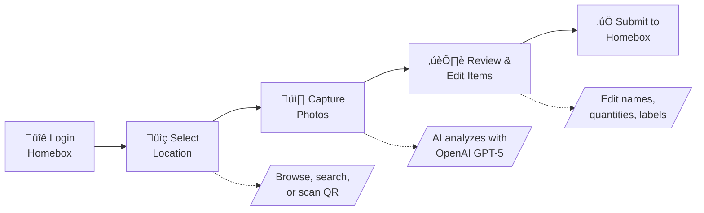

# 📦 Homebox Companion

> **Not affiliated with the Homebox project.** This is an unofficial third-party companion app.

AI-powered companion for [Homebox](https://github.com/sysadminsmedia/homebox) inventory management.

Take a photo of your stuff, and let AI identify and catalog items directly into your Homebox instance. Perfect for quickly inventorying a room, shelf, or collection.


## 🔄 How It Works



1. **Login** – Authenticate with your existing Homebox credentials
2. **Select Location** – Browse the location tree, search, or scan a Homebox QR code
3. **Capture Photos** – Take or upload photos of items (supports multiple photos per item)
4. **AI Detection** – OpenAI vision identifies items, quantities, and metadata
5. **Review & Edit** – Adjust AI suggestions, merge items, or ask AI to correct mistakes
6. **Submit** – Items are created in your Homebox inventory with photos attached

https://github.com/user-attachments/assets/3d1e9107-9a9e-47e7-88e5-f4934a4a79e8

## 💰 OpenAI Cost Estimates

Prices as of **2025-12-10**, using OpenAI’s published pricing for GPT-5 mini and GPT-5 nano.   

**Per-token pricing (per 1M tokens):**

- **GPT-5 nano**
  - Input: **$0.0500 / 1M tokens**
  - Output: **$0.4000 / 1M tokens**

- **GPT-5 mini**
  - Input: **$0.2500 / 1M tokens**
  - Output: **$2.0000 / 1M tokens**

All estimates below are based on measured token usage from this app’s production prompt with 1–5 images per call.

### Estimated API cost for Homebox Companion

#### GPT-5 mini

| Images per call | Cost / 1 call | Cost / 100 calls | Cost / 500 calls | Cost / 1,000 calls |
|----------------:|--------------:|-----------------:|-----------------:|-------------------:|
| 1 | **$0.0026** | **$0.2580** | **$1.2900** | **$2.5800** |
| 2 | **$0.0032** | **$0.3236** | **$1.6180** | **$3.2360** |
| 3 | **$0.0031** | **$0.3130** | **$1.5650** | **$3.1300** |
| 4 | **$0.0037** | **$0.3672** | **$1.8360** | **$3.6720** |
| 5 | **$0.0041** | **$0.4108** | **$2.0540** | **$4.1080** |

#### GPT-5 nano

| Images per call | Cost / 1 call | Cost / 100 calls | Cost / 500 calls | Cost / 1,000 calls |
|----------------:|--------------:|-----------------:|-----------------:|-------------------:|
| 1 | **$0.0008** | **$0.0801** | **$0.4005** | **$0.8010** |
| 2 | **$0.0008** | **$0.0781** | **$0.3907** | **$0.7815** |
| 3 | **$0.0010** | **$0.0958** | **$0.4788** | **$0.9577** |
| 4 | **$0.0014** | **$0.1386** | **$0.6929** | **$1.3858** |
| 5 | **$0.0013** | **$0.1264** | **$0.6320** | **$1.2639** |


## 📋 Requirements

Before you start, you'll need:

- **An OpenAI API key** – Get one at [platform.openai.com](https://platform.openai.com/api-keys)
- **A Homebox instance** – Your own [Homebox](https://github.com/sysadminsmedia/homebox) server, or use the [demo server](#try-with-demo-server) to test

## 🚀 Quick Start

### Try with Demo Server

Want to try it out without setting up Homebox? Use the public demo server:

```bash
docker run -p 8000:8000 \
  -e HBC_OPENAI_API_KEY=sk-your-key \
  -e HBC_HOMEBOX_URL=https://demo.homebox.software \
  ghcr.io/duelion/homebox-companion:latest
```

Open `http://localhost:8000` and login with `demo@example.com` / `demo`

### Docker (Recommended)

```yaml
# docker-compose.yml
services:
  homebox-companion:
    image: ghcr.io/duelion/homebox-companion:latest
    container_name: homebox-companion
    restart: always
    environment:
      - HBC_OPENAI_API_KEY=sk-your-api-key-here
      - HBC_HOMEBOX_URL=http://your-homebox-ip:7745
    ports:
      - 8000:8000
```

```bash
docker compose up -d
```

Open `http://localhost:8000` in your browser.

> **Tip:** If Homebox runs on the same machine but outside Docker, use `http://host.docker.internal:PORT` as the URL.

### Run from Source

Alternative to Docker if you prefer running directly on your system.

**Prerequisites:** Python 3.12+, Node.js 18+, [uv](https://docs.astral.sh/uv/)

```bash
# Clone and install
git clone https://github.com/Duelion/homebox-companion.git
cd homebox-companion
uv sync

# Build frontend
cd frontend && npm install && npm run build && cd ..
mkdir -p server/static && cp -r frontend/build/* server/static/

# Configure
cat > .env << 'EOF'
HBC_OPENAI_API_KEY=sk-your-key
HBC_HOMEBOX_URL=http://localhost:7745
EOF

# Run
uv run python -m server.app
```

Open `http://localhost:8000` in your browser.

## ✨ Features

### AI-Powered Detection
- Identifies multiple items in a single photo
- Extracts manufacturer, model, serial number, price when visible
- Suggests labels from your existing Homebox labels
- Multi-language support

### Smart Workflow
- **Multi-image analysis** – Take photos from multiple angles for better accuracy
- **Single-item mode** – Force AI to treat a photo as one item (for sets/kits)
- **AI corrections** – Tell the AI what it got wrong and it re-analyzes
- **Custom thumbnails** – Crop and select the best image for each item

### Location Management
- Browse hierarchical location tree
- Search locations by name
- Scan Homebox QR codes
- Create new locations on the fly

### Customization
- Configure how AI formats each field (name style, description format, etc.)
- Set a default label for all detected items
- Export settings as environment variables for Docker persistence

## ⚙️ Configuration

### Essential Settings

| Variable | Required | Default | Description |
|----------|----------|---------|-------------|
| `HBC_OPENAI_API_KEY` | **Yes** | – | Your OpenAI API key |
| `HBC_HOMEBOX_URL` | No | Demo server | Your Homebox URL |
| `HBC_OPENAI_MODEL` | No | `gpt-5-mini` | Model to use (`gpt-5-nano` for cheaper) |

### Advanced Settings

<details>
<summary>Server & Logging</summary>

| Variable | Default | Description |
|----------|---------|-------------|
| `HBC_SERVER_HOST` | `0.0.0.0` | Server bind address |
| `HBC_SERVER_PORT` | `8000` | Server port |
| `HBC_LOG_LEVEL` | `INFO` | Logging level |
| `HBC_DISABLE_UPDATE_CHECK` | `false` | Disable update notifications |

</details>

<details>
<summary>AI Output Customization</summary>

Customize how AI formats detected item fields. Set via environment variables or the Settings page (UI takes priority).

| Variable | Description |
|----------|-------------|
| `HBC_AI_OUTPUT_LANGUAGE` | Language for AI output (default: English) |
| `HBC_AI_DEFAULT_LABEL_ID` | Label ID to auto-apply to all items |
| `HBC_AI_NAME` | Custom instructions for item naming |
| `HBC_AI_DESCRIPTION` | Custom instructions for descriptions |
| `HBC_AI_QUANTITY` | Custom instructions for quantity counting |
| `HBC_AI_MANUFACTURER` | Instructions for manufacturer extraction |
| `HBC_AI_MODEL_NUMBER` | Instructions for model number extraction |
| `HBC_AI_SERIAL_NUMBER` | Instructions for serial number extraction |
| `HBC_AI_PURCHASE_PRICE` | Instructions for price extraction |
| `HBC_AI_PURCHASE_FROM` | Instructions for retailer extraction |
| `HBC_AI_NOTES` | Custom instructions for notes |
| `HBC_AI_NAMING_EXAMPLES` | Example names to guide the AI |

**Tip:** The Settings page has an "Export as Environment Variables" button.

</details>

## 💡 Tips

- **HTTPS recommended for QR scanning** – Native camera QR detection only works over HTTPS. On HTTP, a "Take Photo" fallback is available.
- **Multiple photos = better results** – Include close-ups of labels, serial numbers, or receipts for more accurate detection.

## 📄 License

MIT License

## 🙏 Acknowledgments

- [Homebox](https://github.com/sysadminsmedia/homebox) – The inventory system this app extends
- [OpenAI](https://openai.com) – Vision AI capabilities
- [FastAPI](https://fastapi.tiangolo.com) & [SvelteKit](https://kit.svelte.dev) – Backend & frontend frameworks
