# Homebox Companion

AI-powered companion app for [Homebox](https://github.com/sysadminsmedia/homebox) inventory management.

Take a photo of your stuff, and let AI identify and catalog items directly into your Homebox instance. Perfect for quickly inventorying a room, shelf, or collection.

## What It Does

Homebox Companion streamlines the process of adding items to your home inventory:

```mermaid
flowchart LR
    A[🔐 Login<br/>Homebox] --> B[📍 Select<br/>Location]
    B --> C[📸 Capture<br/>Photos]
    C --> D[✏️ Review &<br/>Edit Items]
    D --> E[✅ Submit to<br/>Homebox]
    
    B -.-> B1[/Hierarchical<br/>location tree/]
    C -.-> C1[/AI analyzes with<br/>OpenAI GPT-5/]
    D -.-> D1[/Edit names,<br/>quantities, labels/]
```



1. **Login** – Authenticate with your existing Homebox credentials
2. **Select Location** – Navigate your hierarchical location tree (e.g., Home → Garage → Toolbox)
3. **Capture Photos** – Take or upload photos of items (supports multiple photos per item)
4. **AI Detection** – OpenAI vision identifies items, quantities, and metadata
5. **Review & Edit** – Adjust AI suggestions, merge items, or ask AI to correct mistakes
6. **Submit** – Items are created in your Homebox inventory with photos attached

## Features

### Core Features
- **Photo-based Detection** – Upload or capture photos of items from your device
- **AI Vision Analysis** – Uses OpenAI GPT-5 to identify items in images
- **Smart Labeling** – Automatically suggests labels from your existing Homebox labels
- **Hierarchical Locations** – Navigate and select from your full location tree
- **Batch Processing** – Analyze multiple photos in parallel for faster processing
- **Mobile-First UI** – Designed for phones (works great on desktop too)

### AI Capabilities
- **Multi-Image Analysis** – Upload multiple photos of the same item taken from different angles or distances to improve detection accuracy. You can also include close-ups of labels, serial numbers, receipts, and other identifying details to enhance recognition.
- **Extended Fields Detection** – Automatically extracts manufacturer, model number, serial number, purchase price when visible
- **Single-Item Mode** – Force AI to treat everything in a photo as one item (useful for sets/kits)
- **AI Corrections** – Tell the AI what it got wrong and it will re-analyze with your feedback
- **Label Matching** – AI suggests appropriate labels from your existing Homebox label library
- **Customizable Field Instructions** – Configure how the AI formats each field (name, description, notes, etc.)
- **Multi-Language Output** – Configure AI to respond in your preferred language

### Review Features
- **Edit Detected Items** – Modify names, quantities, descriptions before saving
- **Custom Thumbnails** – Crop and select the best thumbnail for each item
- **Skip or Confirm** – Review each detected item individually
- **Add More Photos** – Attach additional images during review for better AI analysis

### Settings & Customization
- **Default AI Tag** – Set a default label that's automatically applied to all detected items (great for tagging items as "Added via Companion")
- **Output Language** – Configure AI to respond in your preferred language
- **Field Customization** – Customize how AI formats each field:
  - Name format (e.g., "Title Case, include brand")
  - Description style (e.g., "Focus on condition and materials")
  - Notes guidelines (e.g., "Only mention defects")
  - And more (manufacturer, model, serial, price, etc.)
- **Navigation Persistence** – Tab switching preserves your position in the scan flow

## Quick Start

### Prerequisites

- Python 3.12+
- Node.js 18+ (for frontend development)
- [uv](https://docs.astral.sh/uv/) (recommended) or pip
- An OpenAI API key ([get one here](https://platform.openai.com/api-keys))
- A Homebox instance (or use the demo server)

### Installation

```bash
# Clone the repository
git clone https://github.com/Duelion/homebox-companion.git
cd homebox-companion

# Install Python dependencies
uv sync

# Install frontend dependencies
cd frontend && npm install && cd ..
```

### Configuration

For local development, create a `.env` file:

```bash
# .env file contents
HBC_OPENAI_API_KEY=sk-your-api-key-here
HBC_HOMEBOX_URL=http://localhost:7745  # or https://your-homebox.example.com
HBC_OPENAI_MODEL=gpt-5-mini
HBC_LOG_LEVEL=INFO
```

You can also set the environment variables directly:

**Linux/macOS:**
```bash
# Required: Your OpenAI API key
export HBC_OPENAI_API_KEY="sk-your-api-key-here"

# Optional: Your Homebox URL (default: demo server)
# We automatically append /api/v1 to this URL
# Include port if your Homebox isn't behind a reverse proxy
export HBC_HOMEBOX_URL="http://192.168.1.100:7745"  # or https://your-homebox.example.com

# Optional: OpenAI model (default: gpt-5-mini)
export HBC_OPENAI_MODEL="gpt-5-mini"

# Optional: Server configuration
export HBC_SERVER_HOST="0.0.0.0"
export HBC_SERVER_PORT="8000"

# Optional: Log level (DEBUG, INFO, WARNING, ERROR)
export HBC_LOG_LEVEL="INFO"
```

**Windows (PowerShell):**
```powershell
$env:HBC_OPENAI_API_KEY = "sk-your-api-key-here"
$env:HBC_HOMEBOX_URL = "http://192.168.1.100:7745"  # Include port if no reverse proxy
```

### Running the App

**Development (two terminals):**

```bash
# Terminal 1: Start backend API (port 8000)
uv run uvicorn server.app:app --reload --host 0.0.0.0 --port 8000

# Terminal 2: Start frontend dev server (port 5173)
cd frontend && npm run dev
```

Open `http://localhost:5173` in your browser. The Vite dev server proxies `/api` requests to the backend.

**Production (single service):**

```bash
# Build frontend to static files
cd frontend && npm run build

# Copy build output to server static directory
cp -r build/* ../server/static/
cd ..

# Start server (serves both API and frontend on port 8000)
uv run python -m server.app
```

**Docker (Recommended):**

Pull the latest image from GitHub Container Registry:

```bash
docker pull ghcr.io/duelion/homebox-companion:latest
```

Then create a `docker-compose.yml` file:

```yaml
version: "3.4"

services:
  homebox-companion:
    image: ghcr.io/duelion/homebox-companion:latest
    container_name: homebox-companion
    restart: always
    environment:
      - HBC_OPENAI_API_KEY=sk-your-api-key-here
      # Use your Homebox URL with port (e.g., http://192.168.1.100:7745)
      # Or domain if behind reverse proxy (e.g., https://homebox.example.com)
      - HBC_HOMEBOX_URL=http://192.168.1.100:7745
      - HBC_OPENAI_MODEL=gpt-5-mini
      - HBC_LOG_LEVEL=INFO
      # Optional: AI output customization (persists across container updates)
      # - HBC_AI_OUTPUT_LANGUAGE=Spanish
      # - HBC_AI_NAME=Always include brand first, then model
    ports:
      - 8000:8000
```

Then run:

```bash
docker compose up -d
```

**Docker Run:**

```bash
docker run -d -p 8000:8000 \
  -e HBC_OPENAI_API_KEY="sk-your-api-key-here" \
  -e HBC_HOMEBOX_URL="http://192.168.1.100:7745" \
  ghcr.io/duelion/homebox-companion:latest
```

> **Note for Docker networking:** If your Homebox instance runs on the same machine (but outside Docker), use `http://host.docker.internal:PORT` as the URL. For example, if Homebox runs on port 7745:
> ```yaml
> - HBC_HOMEBOX_URL=http://host.docker.internal:7745
> ```
> On Linux, you may need to add `--add-host=host.docker.internal:host-gateway` to the docker run command, or use `network_mode: host` in your compose file.

## Environment Variables Reference

All environment variables use the `HBC_` prefix (short for Homebox Companion).

### Core Settings

| Variable | Required | Default | Description |
|----------|----------|---------|-------------|
| `HBC_OPENAI_API_KEY` | Yes | - | Your OpenAI API key |
| `HBC_HOMEBOX_URL` | No | Demo server | Your Homebox URL with port if needed, e.g., `http://192.168.1.100:7745` (we append `/api/v1` automatically) |
| `HBC_OPENAI_MODEL` | No | `gpt-5-mini` | OpenAI model for vision (`gpt-5-nano` for fastest/cheapest) |
| `HBC_SERVER_HOST` | No | `0.0.0.0` | Server bind address |
| `HBC_SERVER_PORT` | No | `8000` | Server port |
| `HBC_LOG_LEVEL` | No | `INFO` | Logging level |
| `HBC_DISABLE_UPDATE_CHECK` | No | `false` | Set to `true` to disable update notifications |

### AI Output Customization

These settings configure how the AI generates item data. They can also be set via the Settings page UI, which takes priority over environment variables. Use these to persist customizations across Docker container updates.

| Variable | Default | Description |
|----------|---------|-------------|
| `HBC_AI_OUTPUT_LANGUAGE` | English | Language for AI-generated text (names, descriptions, notes) |
| `HBC_AI_DEFAULT_LABEL_ID` | - | Label ID to auto-apply to all created items |
| `HBC_AI_NAME` | - | Custom instructions for item naming |
| `HBC_AI_DESCRIPTION` | - | Custom instructions for descriptions |
| `HBC_AI_QUANTITY` | - | Custom instructions for quantity counting |
| `HBC_AI_MANUFACTURER` | - | Custom instructions for manufacturer extraction |
| `HBC_AI_MODEL_NUMBER` | - | Custom instructions for model number extraction |
| `HBC_AI_SERIAL_NUMBER` | - | Custom instructions for serial number extraction |
| `HBC_AI_PURCHASE_PRICE` | - | Custom instructions for price extraction |
| `HBC_AI_PURCHASE_FROM` | - | Custom instructions for retailer extraction |
| `HBC_AI_NOTES` | - | Custom instructions for notes |
| `HBC_AI_NAMING_EXAMPLES` | - | Custom naming examples for the AI |

**Tip:** The Settings page includes an "Export as Environment Variables" button that generates these variables from your current customizations, ready to paste into your `docker-compose.yml`.

## Using with Demo Server

For testing, you can use the Homebox demo server (this is the default if `HBC_HOMEBOX_URL` is not set):

```bash
export HBC_HOMEBOX_URL="https://demo.homebox.software"
```

Demo credentials: `demo@example.com` / `demo`

## Project Structure

```
homebox-companion/
├── src/
│   └── homebox_companion/          # Python package
│       ├── core/                   # Config, logging, exceptions
│       ├── homebox/                # Homebox API client
│       ├── ai/                     # OpenAI integration & prompts
│       └── tools/                  # AI tools (vision, etc.)
│           └── vision/             # Item detection & analysis
├── server/                         # FastAPI backend
│   ├── app.py                      # App factory
│   ├── api/                        # API routers
│   │   └── tools/vision.py         # Vision endpoints
│   └── schemas/                    # Pydantic models
├── frontend/                       # Svelte + Tailwind frontend
│   └── src/
│       ├── lib/                    # Stores, API client, components
│       └── routes/                 # SvelteKit pages
├── tests/                          # Test suite
├── pyproject.toml                  # Python config
├── Dockerfile                      # Docker build
└── AGENTS.md                       # AI agent guidelines
```

## API Endpoints

| Method | Endpoint | Description |
|--------|----------|-------------|
| POST | `/api/login` | Authenticate with Homebox |
| GET | `/api/locations` | List all locations |
| GET | `/api/locations/tree` | Get hierarchical location tree |
| GET | `/api/locations/{id}` | Get single location with children |
| POST | `/api/locations` | Create a new location |
| PUT | `/api/locations/{id}` | Update a location |
| GET | `/api/labels` | List all labels |
| POST | `/api/items` | Batch create items |
| POST | `/api/items/{id}/attachments` | Upload item attachment |
| POST | `/api/tools/vision/detect` | Detect items in a single image |
| POST | `/api/tools/vision/detect-batch` | Detect items in multiple images (parallel) |
| POST | `/api/tools/vision/analyze` | Multi-image analysis for extended details |
| POST | `/api/tools/vision/merge` | Merge multiple items using AI |
| POST | `/api/tools/vision/correct` | Correct item with user feedback |
| GET | `/api/settings/field-preferences` | Get AI field customization settings |
| PUT | `/api/settings/field-preferences` | Update AI field customization settings |
| GET | `/api/version` | Get application version |

## Library Usage

The `homebox_companion` package can also be used as a Python library:

```python
import asyncio
from homebox_companion import detect_items_from_bytes, HomeboxClient, ItemCreate

async def main():
    # Read an image file
    with open("items.jpg", "rb") as f:
        image_bytes = f.read()

    # Detect items in the image
    items = await detect_items_from_bytes(image_bytes)
    for item in items:
        print(f"{item.name}: {item.quantity}")
        if item.manufacturer:
            print(f"  Manufacturer: {item.manufacturer}")

    # Create items in Homebox
    async with HomeboxClient() as client:
        token = await client.login("user@example.com", "password")
        locations = await client.list_locations(token)
        
        for item in items:
            item_create = ItemCreate(
                name=item.name,
                quantity=item.quantity,
                description=item.description,
                location_id=locations[0]["id"],
                label_ids=item.label_ids,
            )
            created = await client.create_item(token, item_create)
            print(f"Created: {created['name']} (ID: {created['id']})")

asyncio.run(main())
```

### Available Exports

```python
from homebox_companion import (
    # Configuration
    settings,
    
    # Client (async)
    HomeboxClient,
    ItemCreate,
    ItemUpdate,
    
    # Exceptions
    AuthenticationError,
    
    # Vision detection
    DetectedItem,
    detect_items_from_bytes,
    discriminatory_detect_items,
    
    # Advanced AI functions
    analyze_item_details_from_images,
    correct_item_with_openai,
    merge_items_with_openai,
    
    # Image utilities
    encode_image_to_data_uri,
    encode_image_bytes_to_data_uri,
)
```

## Development

### Linting

```bash
uv run ruff check .
uv run ruff format .
```

### Testing

```bash
# Run unit tests
uv run pytest

# Run integration tests (requires API keys)
uv run pytest -m integration
```

### Frontend Development

```bash
cd frontend
npm run dev      # Start dev server with hot reload
npm run build    # Production build
npm run preview  # Preview production build
```

## Contributing

Contributions are welcome! Please ensure:

1. Code passes `ruff check .`
2. Tests pass with `pytest`
3. Increment version in `pyproject.toml`
4. Update `package-lock.json` if modifying frontend dependencies

## License

MIT License - see LICENSE file for details.

## Acknowledgments

- [Homebox](https://github.com/sysadminsmedia/homebox) - The excellent home inventory system this companion is built for
- [OpenAI](https://openai.com) - For the vision AI capabilities
- [FastAPI](https://fastapi.tiangolo.com) - The modern Python web framework
- [SvelteKit](https://kit.svelte.dev) - The elegant frontend framework
- [Tailwind CSS](https://tailwindcss.com) - The utility-first CSS framework
